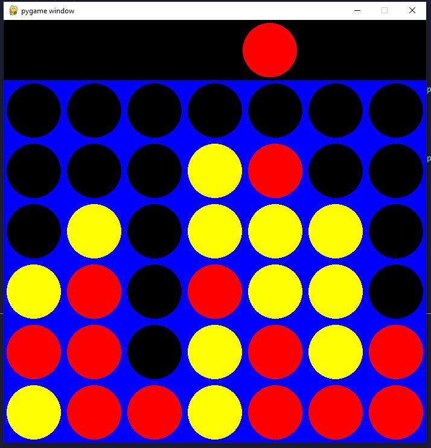

# Connect Four Game

<div align="center">
    
</div>

This Connect Four game is implemented in Python and utilizes various libraries and modules for different functionalities.

## Game Modes

- `Easy Mode`: Play against a simple AI that makes random moves. Type `Connect4_AI_EasyMode.py` into terminal.
- `Hard Mode`: Challenge yourself against a more advanced AI that uses the minimax algorithm to make strategic moves. Type `Connect4_AI_HardMode.py` into terminal.
- `Two-Player Mode`: Play against another human player on the same device, taking turns to drop colored discs into the grid. Type `Connect4_AI_TwoPlayers.py` into terminal.

## Game Logic

The game implements the classic Connect Four rules, where two players take turns dropping colored discs into a grid. The objective is to connect four of one's own discs of the same color vertically, horizontally, or diagonally before your opponent. The game continues until one player achieves this objective or the grid is full, resulting in a draw.

## Key Features

- `Multiple Game Modes`: Enjoy three different game modes, including Easy Mode against a simple AI, Hard Mode against a challenging AI, and Two-Player Mode for playing against another human player.

- `Classic Gameplay`: Experience the classic Connect Four gameplay, where players take turns dropping colored discs into a grid to connect four discs of the same color vertically, horizontally, or diagonally.

- `Minimax Algorithm`: Challenge yourself against the Hard Mode AI, which uses the powerful Minimax Algorithm to make strategic moves and provide a tough opponent.

## Minimax Algorithm Implementation

The Minimax Algorithm is utilized to power the AI opponent in Hard Mode. Here's a snippet of the code implementing the Minimax Algorithm:

```python
# The algorithm calculating the best move to make given a depth of the search tree.
# Depth is how many layers algorithm scores boards. Complexity grows exponentially.
# Alpha and beta are best scores a side can achieve assuming the opponent makes the best play.
def minimax(board, depth, alpha, beta, maximizing_player):
    # Implementation details...
    pass
```

## Running the Program

To run the Connect Four game program:

1. Ensure you have Python installed on your system. If not, you can download and install it from the official Python website.
2. Clone `git clone https://github.com/jvang0620/Connect4-AI-MiniMax` or download the Connect Four game repository to your local machine.
3. Navigate to the directory containing the game files using the command line or terminal.
4. Run the following command to start the game:

```bash
python connect_four.py
```

5. Choose your desired game mode (Easy, Hard, or Two-Player) and enjoy playing!

## Final Note:

- Ensure that you have the required dependencies (such as Pygame and Numpy) installed. You can install them using pip if not already installed.

Now, you're all set to enjoy playing Connect Four with various game modes and challenge levels!

## Develope Using


